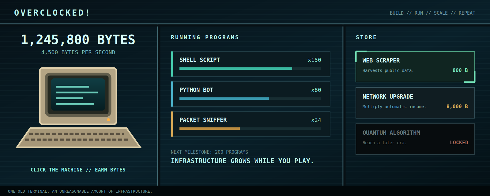

# Overclocked!

An idle clicker about turning one old terminal into a distributed computing empire.



## Play

**[Launch Overclocked!](https://overclocked-game.vercel.app)**

Click the machine, buy your first Shell Script, and let the operation grow. Progress is saved in your browser.

## Features

- Twelve programs that produce Bytes and unlock across distinct infrastructure eras
- Program milestones and synergies that reward long-term planning
- Active-play systems including Critical Clicks, Surges, data packets, and random events
- Risk-and-reward Overclocking with heat, cooling upgrades, and thermal lockdowns
- Prestige runs with permanent Ghost Byte bonuses
- Versioned local saves, recovery autosaves, offline earnings, and portable backups
- Desktop and mobile layouts with keyboard controls and reduced motion support

## Run Locally

Requires [Node.js](https://nodejs.org/) 20 or newer.

```bash
npm install
npm start
```

Open `http://localhost:5173`.

To create a production build:

```bash
npm run build
```

## How It Works

Overclocked! is a vanilla JavaScript and CSS game built with Vite. The economy, rendering, save migration, offline earnings, and event systems all run in the browser. There is no account or backend: saves remain local, with a previous known-good autosave kept for recovery.

The interface follows the readable three-column rhythm of classic browser idle games. Licensed computer photography marks each stage of progression, while the surrounding HUD stays compact enough to keep clicking, production, and purchasing visible at the same time.

## Controls

| Control | Action |
| --- | --- |
| Click the machine or press `Space` | Earn Bytes |
| Press `B` | Cycle purchase quantity |
| Click the temperature meter | Vent heat after unlocking the manual fan |
| Options | Save, restore, import, export, or reduce motion |

## Deployment

The production site is hosted on Vercel and connected to the `main` branch of this GitHub repository.

- Live game: [overclocked-game.vercel.app](https://overclocked-game.vercel.app)
- Production build: `npm run build`
- Vercel output directory: `dist`

## Credits

Overclocked! uses licensed hardware photography and open game-interface assets. See [CREDITS.md](CREDITS.md) for authors, sources, and licenses.
